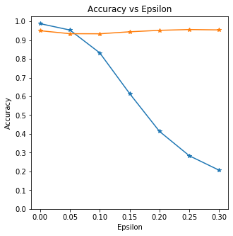
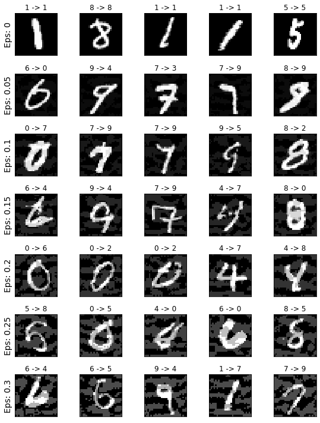

# Fast Gradient Sign Method (FGSM)

FGSM is one of the most popular Adversarial attack. It is powerful and intuitive.

## FGSM Attack on MNIST

### MNIST model
- ```python
  class MnistModel(nn.Module):
    def __init__(self):
        super(MnistModel, self).__init__()
        self.conv1 = nn.Conv2d(1, 32, kernel_size = 5, padding=2)
        self.conv2 = nn.Conv2d(32, 64, kernel_size = 5, padding=2)
        self.fc1 = nn.Linear(64*7*7, 1024)
        self.fc2 = nn.Linear(1024, 10)

    def forward(self, x):
        x = F.max_pool2d(F.relu(self.conv1(x)), 2)
        x = F.max_pool2d(F.relu(self.conv2(x)), 2)
        x = x.view(-1, 64*7*7)
        x = F.relu(self.fc1(x))
        x = F.dropout(x, training=self.training)
        x = self.fc2(x)
        return F.log_softmax(x)
  ```

### FGSM Attack
- ```python
  def fgsm_attack(image, epsilon, data_grad):
    # gradient의 부호를 반환한다
    sign_data_grad = data_grad.sign()
    # input image의 pixel의 값을 조정하여 perturbed image를 만들어낸다
    perturbed_image = image + epsilon*sign_data_grad
    # 0, 1 범위를 유지하기 위해 벗어나는 값들을 조정한다
    perturbed_image = torch.clamp(perturbed_image, 0, 1)
    #Return perturbed image
    return perturbed_image
  ```

### Adding FGSM attacked images to training
- ```python
  from advertorch.attacks import GradientSignAttack as FGSM

  def advtrain(model, device, train_loader, optimizer, epoch, log_interval):
    model.train()
    avg_loss = 0
    # in training loop:
    
    adversary = FGSM(model, loss_fn=nn.NLLLoss(reduction='sum'), 
                    eps=0.3, clip_min=0., clip_max=1., targeted=False)

    for batch_idx, (data, target) in enumerate(train_loader):
        data, target = data.to(device), target.to(device)
        data = adversary.perturb(data, target)
        optimizer.zero_grad()
        output = model(data)
        loss = F.nll_loss(output, target)
        loss.backward()
        optimizer.step()
        avg_loss+=F.nll_loss(output, target, reduction='sum').item()
        
        if batch_idx % log_interval == 0:
            print('Train Epoch: {} [{}/{} ({:.0f}%)]\tLoss: {:.6f}'.format(
                epoch, batch_idx * len(data), len(train_loader.dataset),
                100. * batch_idx / len(train_loader), loss.item()))

    avg_loss/=len(train_loader.dataset)
    return avg_loss
  ```
## Result

### Accuracy & Epsilon  

  

### Sample Attacked MNIST examples  

  
